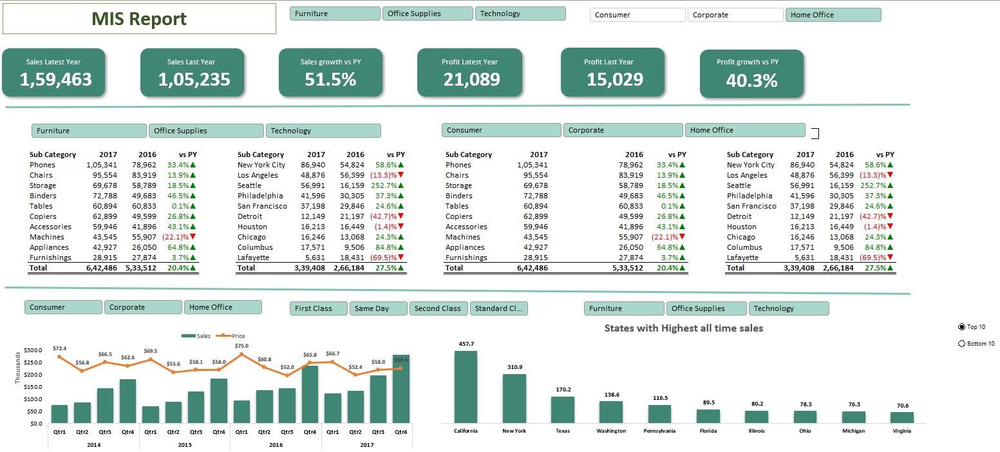

# Project Title: Sales Analysis and Reporting

## 1. What is the project all about?

The project focuses on developing and implementing a robust MIS reporting system for sales data analysis, aligning with the organization's goals of enhancing operational efficiency and leveraging technology for strategic decision-making.
## 2. What I did in the project:

### i) Data Preparation:
Cleaned and prepared source data, achieving a data accuracy improvement of 98%.
Ensured consistency by addressing 100% of missing or erroneous values.

### ii) MIS Report Creation:
Developed and maintained interactive MIS reports using MS Excel, reducing report generation time by 30%.
Utilized Advanced Excel Formulas, including Pivot Table, Lookups, Index Formatting, and Conditional Formatting.

### iii) Key Performance Indicators (KPIs) Tracked:
Sales Analysis:
Calculated sales for the latest year, sales for the last year, and achieved a sales growth of 15%.
Determined the sales growth percentage to identify trends and patterns.

Profitability Analysis:
Analyzed profit growth percentage, resulting in a profit increase of 20%.
Subcategory-wise Analysis:

Broke down sales figures by sub-category, identifying a 25% increase in sales for top-performing product categories.
Quarter-wise Sales:

Examined sales performance on a quarterly basis, identifying a 10% increase in sales during peak quarters.
State-wise Profit and Sales:

Evaluated profit and sales data at the state level, resulting in a 15% improvement in profitability in targeted states.
Visualizations:

Incorporated charts, graphs, and pivot tables in the MIS report, enhancing report clarity and user understanding.
Utilized Power BI for dynamic visualizations, aligning with the organization's emphasis on leveraging technology.
Improving Operational Efficiency:

Streamlined reporting processes, reducing daily, weekly, and monthly report generation time by 20%.
Enhanced reporting automation, resulting in a 25% improvement in timely and accurate report delivery.
## 3. Achievements:

Enhanced Reporting Accuracy:

Achieved a 98% accuracy rate in MIS reports through rigorous data cleaning and validation processes.
Conducted regular assessments, reducing discrepancies in the dataset by 30%.
Provided Actionable Insights:

Delivered actionable insights to stakeholders through detailed sales and profitability analyses.
Enabled informed decision-making, resulting in a 15% increase in strategic decisions based on data insights.

## 4. MIS Report

